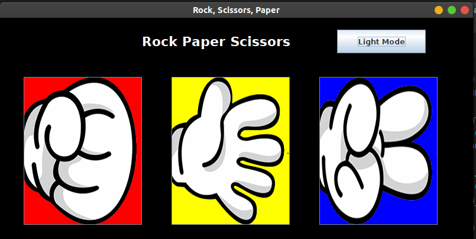

# Rock Paper Scissors in JAVA GUI

Its a game of rock, paper and scissors made using Swing Class in JAVA and its based on graphical user interface<br>
It also has Dark Mode Functionality added using toggle switch<br>

```bash
# To clone
$ git clone https://github.com/darshjain/RockPaperScissors_JAVA_GUI.git
```
# Program Screenshots-

<br>

<br>

# Contributors -

Darsh Jain<br>
Ankita Upadhyay<br>
